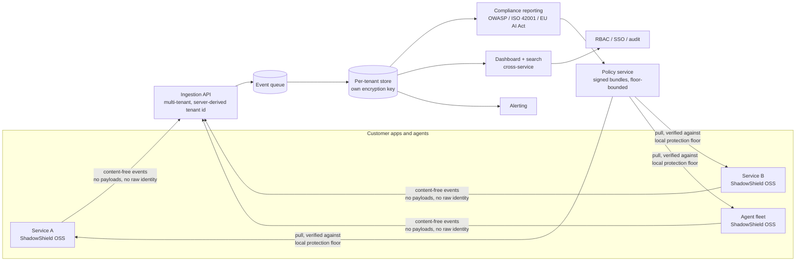

# ShadowShield — Open-Core SaaS Strategy (v2, post-review)

**Date:** 2026-06-16 · **Status:** strategy brief · **Companions:** [MARKET_LANDSCAPE.md](MARKET_LANDSCAPE.md) · [PLAN_REVIEW.md](PLAN_REVIEW.md)

> **v2 changes (folded in from the multi-model panel review):** the lead wedge moved from
> audit-search to **compliance reporting**, with **fleet policy push** as the expansion; a hard
> **design-partner pre-sell gate** now precedes any backend build; the architecture adds a
> non-overridable **protection floor** and a **content-free telemetry schema**; and we add a
> **deployed-adoption North Star**, an **MIT-forever** pledge, and **enterprise table-stakes** as
> launch criteria. The original v1 reasoning is preserved where the panel endorsed it.

The thesis is unchanged: **ShadowShield (engine) stays open source and wins adoption; a hosted,
multi-tenant control plane becomes the commercial product.** What changed is *which* control-plane
feature leads, and the discipline gating the build.

---

## What the review changed (and why)

A four-reviewer panel (VC/moat, security engineer, pre-mortem, AppSec buyer) converged on one
correction: **centralized audit + search — v1's lead wedge — is the weakest link**, squeezed by
free (self-hosted OSS), bundled (incumbent platforms), and already-bought (the customer's SIEM).
The buyer ranked willingness-to-pay as **compliance reporting > fleet policy push > audit-search >
alerting**. So:

- **Lead with compliance reporting.** Auto-generated OWASP-LLM-Top-10 coverage, ISO/IEC 42001
  control mappings, and EU AI Act Art. 15 (robustness) attestations from a fleet's *actual*
  detections — the thing a CISO would pay for today and that no SIEM auto-generates.
- **Expand with fleet policy push** — but only after the **protection floor** (below) ships, because
  the security reviewer flagged uncontrolled policy push as the single most dangerous failure mode.
- **Demote audit-search** to a supporting feature of the above, not the headline.

---

## Open-core boundary

| Capability | OSS (free, MIT) | ShadowShield Cloud (paid) |
|---|:--:|:--:|
| Detection + response engine (all detectors/responders) | ✅ | ✅ |
| CLI, library, integrations (OpenAI, LangChain, …) | ✅ | ✅ |
| Single-node control dashboard (`serve --control`) | ✅ | ✅ |
| Local JSONL audit log + Prometheus `/metrics` | ✅ | ✅ |
| API-key auth + CORS (single-node) | ✅ | ✅ |
| **Compliance reporting** (OWASP / ISO 42001 / EU AI Act artifacts) — *lead wedge* | — | ✅ |
| **Fleet config & policy push** (signed, floor-bounded) — *expansion wedge* | — | ✅ |
| **Multi-tenant hosted ingestion** of scan events from many shields | — | ✅ |
| **Long-term audit retention + cross-service search** | — | ✅ |
| **Alerting** (block-rate anomalies, fleet-wide canary leaks) | — | ✅ |
| **RBAC + SSO/SAML/SCIM** | — | ✅ |
| Self-managed Enterprise (your VPC) + SOC2 + SLA/support | — | ✅ |

Principle (unchanged): the **inline filter is never paywalled**. The paywall sits at
multi-tenancy, governance, retention, fleet management, and compliance — the ~80% of enterprise
buying criteria that reduce to RBAC + SSO + audit + environment separation.

---

## Architecture (hardened)

**Hardening required before the backend (from the security review):**

1. **Non-overridable protection floor in the engine.** A pushed policy must never be able to
   disable detection fleet-wide. The shield enforces a minimum baseline (e.g., prompt-injection and
   canary detection always on), caps how far a bundle may lower protection vs. local config, verifies
   the bundle signature, and on a suspicious/failed bundle **reverts to last-known-good and alerts**
   (fail-safe, never fail-open). This is a prerequisite for shipping policy push at all.
2. **Content-free telemetry by schema, not by config.** Events carry decision/score/severity/detector
   hits/latency only. **No** raw `matched`/`span` text (length/offset at most), **no** raw `identity`
   (hashed with a per-tenant salt), **no** un-redacted `preview`, canary hits carry a hashed ID only.
   Enforced by typed schema fields so "we never see payloads" is true by construction.
3. **Tenant isolation decided up front.** Server-derived tenant IDs (never client-supplied),
   per-tenant encryption keys, a documented ingestion-API threat model, and a breach plan before the
   first paid customer. The telemetry store is a tier-1 target (metadata alone reveals who's under
   attack) and must be operated like a SOC SIEM.

Config/policy push remains **pull-based** (no inbound access to customer infra) — both a security
property and an enterprise-review accelerator.

---

## The wedge (re-sequenced)

1. **Compliance reporting (lead).** Auto-generated, timestamped OWASP-LLM-Top-10 / ISO 42001 / EU AI
   Act Art. 15 reports from real fleet detections. The buyer would pay ~$600/mo for this alone
   because it removes hours of manual audit prep the CISO does today, and no SIEM produces it.
2. **Fleet policy push (expansion).** "Tune one detector across 12 services at 2am without a deploy,"
   versioned and atomically rollback-able — an *active* control a passive SIEM and a single-vendor
   platform can't replicate across a heterogeneous fleet. Gated on the protection floor.
3. **Cross-service audit + alerting (supporting).** AI-threat-native signals (coordinated block-rate
   spikes, fleet-wide canary probing) that generic log search doesn't give — sold as part of the
   above, not as the headline.

---

## Pricing model (unchanged in shape, sharpened)

Benchmarked against transparent comps (Langfuse, Helicone, Arize), explicitly **not** the opaque
"contact sales only" guardrail vendors:

- **Meter on volume (scans/events), generous/unlimited seats.** Security tooling should invite the
  whole team to look, not tax it.
- **Free / self-host:** entire OSS engine + single-node dashboard + `/metrics`. $0 forever.
- **Cloud Starter (self-serve, public price):** hosted ingestion, monthly event cap, short retention,
  one org — the anti-Lakera transparent mid-tier.
- **Team:** higher volume, longer retention, multiple services, compliance reports, alerting, basic RBAC.
- **Enterprise:** long retention, SSO/SAML/SCIM, fleet policy push, self-managed-in-VPC, SOC2, SLA.
  Quote-based **but publish the floor + the variable metric** (the buyer called opaque pricing a
  deal-killer).

Expect to monetize a small single-digit % of OSS users (Confluent does <1% and is a multi-billion
business). That's the model working, not failing.

---

## Licensing (sharpened)

- **Engine: MIT, and publish an MIT-forever commitment in the repo.** The panel flagged a
  panic-relicense as a self-inflicted death; pre-committing removes the option before fear can take it.
- **AGPLv3 is the *only* sanctioned copyleft hedge**, used *only* if hyperscaler resale becomes a real
  threat — never a previously-permissive → source-available (BSL/SSPL) flip. Elastic→OpenSearch,
  HashiCorp→OpenTofu, Redis→Valkey all show that flip triggers an instant LF-backed fork and a
  durable community exodus a later reversion can't undo.
- **Control plane: proprietary, closed (open-core)** — GitLab-EE / Grafana-Enterprise boundary.
- **Optional later:** a source-available (FSL, Apache after 2 years) single-binary self-managed
  edition for VPC-only customers. Not needed for v1.

---

## Go-to-market motion

1. **PLG, bottom-up:** OSS install → local dashboard → multi-service need → self-serve Cloud Starter.
2. **Land-and-expand** (Datadog motion): one service → one team → org-wide fleet + governance (sales-assisted Enterprise).
3. **Distribution = the OSS funnel:** stars + a *cited* benchmark + OWASP-coverage page + integrations
   (LiteLLM, MCP guard server). Reframe the moat as **vendor-neutral control across heterogeneous
   (OSS + hosted + multi-cloud) agent fleets** — the seam no single platform or model vendor owns.
4. **Compliance as the enterprise door-opener:** map every Cloud feature to a compliance artifact.

---

## Gates & North Star (new — the discipline the review demanded)

- **Deployed-adoption North Star:** *orgs running ShadowShield in ≥2 services* (measured via an
  anonymous, opt-out reporter heartbeat — **not** GitHub stars). Backend construction is conditional
  on this growing.
- **Hard pre-sell gate:** **do not build multi-tenant infra** until **≥3 design partners commit money
  or signed LOIs against a *named* capability** (compliance reporting first; if they bite on policy
  push instead, re-sequence around it). One quarter of pre-selling is the cheapest test of the most
  expensive assumption.
- **Credibility gate:** publish adversarial benchmarks (HarmBench/JailbreakBench/TensorTrust) with
  honest gaps, and commission an external red-team + bug bounty **before** monetizing.
- **Enterprise table-stakes** (launch criteria, not later): SOC2 Type II, published p50/p95/p99
  latency (policy fetch < 10 ms), drop-in on-prem control plane (Docker/Helm), transparent price
  floor + metric, full data export.

---

## Open questions to resolve with design partners (before building)

- **Moat: data or distribution?** Validate that teams will centralize AI-threat telemetry in a new
  tool rather than their existing SIEM — counter with AI-native semantics + floor-bounded policy push
  a SIEM can't do.
- **Wedge confirmation:** does compliance reporting clear a real credit card on day one? Does policy
  push? Let the LOIs decide the sequence.
- **Incumbent/model-vendor pincer:** as OpenAI/Anthropic ship native guardrails and platforms bundle
  audit, keep anchoring on the cross-vendor, multi-model, agent-fleet seam.

**Recommendation (unchanged, reinforced):** keep building the OSS engine and its credibility — it is
the asset and the moat. **Do not build the multi-tenant backend yet.** The cheap, reversible steps
that serve both OSS and a future SaaS — the **content-free reporter SDK**, **`/metrics` export**, and
**pull-based config with a protection floor** — are the right next builds, and are specced in
[REPORTER_SDK_SPEC.md](REPORTER_SDK_SPEC.md).
